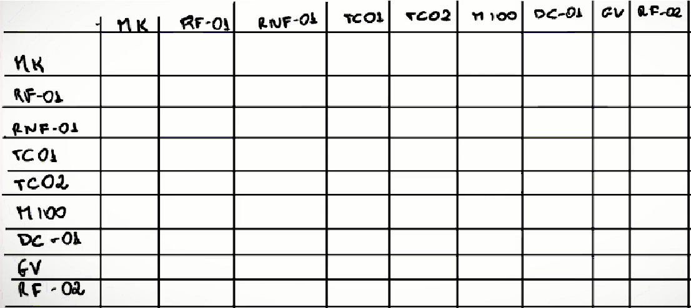

# Especificações do Projeto

##Perfis de Usuários

<table>
<tbody>
<tr>
<th colspan="2">Perfil 01: Educador </th>
</tr>
<tr>
<td width="150px"><b>Descrição</b></td>
<td width="600px">
Funcionários da área de educação , seja de educação pública ou Privada
</td>
</tr>
<tr>
<td><b>Necessidades</b></td>
<td>
1. Acesso Rápido e fácil a tecnicas de primeiros socorros 
2. conteudo explicativo em midias diversas 
3. Acessar materiais confiaveis e de credibilidade 
4. Exercicios para fixação de conteúdo|
</td>
</tr>
</tbody>
</table>

## Histórias de Usuários

|EU COMO... `PERSONA`| QUERO/PRECISO ... `FUNCIONALIDADE` |PARA ... `MOTIVO/VALOR`                 |
|--------------------|------------------------------------|----------------------------------------|
|Professor           |me inscrever para o curso de primeiros socorros  | proteger melhor meus alunos |
|Professor           |ter acesso ao curso de primeiros socorros basicos | manter meu emprego na instituição |
|Monitor             |consultar um tutorial especifico de APH | realizar um salvamento até a ajuda profissional chegar |
|Professor           |conquistar o certificado de conclusão de curso de primeiros socorros | adicionar ao meu curriculo |
|Coordenador         |encontrar o número do atendimento emergencial da area | solicitar uma ambulância |
|Professor           |Pesquisar um procedimento de primeiros socorros  | Prestar um socorro adequado ao aluno |
|Professor           |Saber diferenciar qual serviço emergencial chamar em uma emergência| ligar para ajuda profissional correta quando necessario |
|Professor| Filtrar/Pesquisar um contato de emergência de maneira mais fácil | Encontrar rapidamente o contato da emergência |

## Requisitos

### Requisitos Funcionais

|ID    | Descrição do Requisito  | Prioridade |
|------|-----------------------------------------|----|
|RF-001| A aplicação deve permitir que o usuário cadastrar uma conta | ALTA | 
|RF-002| A aplicação deve permitir que o usuário fazer login da sua conta.  | ALTA |
|RF-003| A aplicação deve oferecer uma funcionalidade de filtro/pesquisa para permitir ao usuário localizar contatos de emegencia. | MÉDIA | 
|RF-004| A aplicação deve oferecer um catálogo de cursos e apostilas.  | ALTA |
|RF-005| A aplicação deve oferecer uma funcionalidade de pesquisa para permitir ao usuário localizar cartilhas e tutoriais específicos. | ALTA | 
|RF-006| A aplicação deve permitir que o usuário gere seu certificado de conclusão de curso. | ALTA |
|RF-007| A aplicação deve oferecer uma página de contatos emergenciais de todos os estados do Brasil. | MÉDIA | 
|RF-008| A aplicação deve oferecer imagens de capa correspondente para cada curso e apostila.   | BAIXA |
|RF-009| A aplicação de permitir que o usuário visualize os cursos ja realizados na página perfil. | MÉDIA | 
|RF-010| A aplicação deve permitir ao usuário visualizar as informações sobre o curso | MÉDIA |

**Prioridade: Alta / Média / Baixa.

### Requisitos não Funcionais

|ID     | Descrição do Requisito  |Prioridade |
|-------|-------------------------|----|
|RNF-001| A aplicação deve ser compatível com os navegadores Google Chrome, Firefox e Microsoft Edge. | ALTA | 
|RNF-002| A aplicação deve ter visualização responsiva adequada em dispositivos diversos. |  ALTA | 
|RNF-003| A aplicação deve oferecer acesso contatos de serviços emergenciais em no máximo 2 segundos |  MÉDIA |

**Prioridade: Alta / Média / Baixa.

## Modelagem do Processo de Negócio 

### Análise da Situação Atual

Apresente aqui os problemas existentes que viabilizam sua proposta. Apresente o modelo do sistema como ele funciona hoje. Caso sua proposta seja inovadora e não existam processos claramente definidos, apresente como as tarefas que o seu sistema pretende implementar são executadas atualmente, mesmo que não se utilize tecnologia computacional. 

### Descrição Geral da Proposta

Apresente aqui uma descrição da sua proposta abordando seus limites e suas ligações com as estratégias e objetivos do negócio. Apresente aqui as oportunidades de melhorias.

### Processo 1 – NOME DO PROCESSO

Apresente aqui o nome e as oportunidades de melhorias para o processo 1. Em seguida, apresente o modelo do processo 1, descrito no padrão BPMN. 

### Processo 2 – NOME DO PROCESSO

Apresente aqui o nome e as oportunidades de melhorias para o processo 2. Em seguida, apresente o modelo do processo 2, descrito no padrão BPMN.

## Indicadores de Desempenho

Apresente aqui os principais indicadores de desempenho e algumas metas para o processo. Atenção: as informações necessárias para gerar os indicadores devem estar contempladas no diagrama de classe. Colocar no mínimo 5 indicadores. 

Usar o seguinte modelo: 

Obs.: todas as informações para gerar os indicadores devem estar no diagrama de classe a ser apresentado a posteriori. 

## Requisitos

As tabelas que se seguem apresentam os requisitos funcionais e não funcionais que detalham o escopo do projeto. Para determinar a prioridade de requisitos, aplicar uma técnica de priorização de requisitos e detalhar como a técnica foi aplicada.

 

Com base nas Histórias de Usuário, enumere os requisitos da sua solução. Classifique esses requisitos em dois grupos:

- [Requisitos Funcionais
 (RF)](https://pt.wikipedia.org/wiki/Requisito_funcional):
 correspondem a uma funcionalidade que deve estar presente na
  plataforma (ex: cadastro de usuário).
- [Requisitos Não Funcionais
  (RNF)](https://pt.wikipedia.org/wiki/Requisito_n%C3%A3o_funcional):
  correspondem a uma característica técnica, seja de usabilidade,
  desempenho, confiabilidade, segurança ou outro (ex: suporte a
  dispositivos iOS e Android).
Lembre-se que cada requisito deve corresponder à uma e somente uma
característica alvo da sua solução. Além disso, certifique-se de que
todos os aspectos capturados nas Histórias de Usuário foram cobertos.

## Restrições

O projeto está restrito pelos itens apresentados na tabela a seguir.

|ID| Restrição                                             |
|--|-------------------------------------------------------|
|01| O projeto deverá ser entregue até o final do semestre |
|02| Não pode ser desenvolvido um módulo de backend        |

## Diagrama de Casos de Uso

O diagrama de casos de uso é o próximo passo após a elicitação de requisitos, que utiliza um modelo gráfico e uma tabela com as descrições sucintas dos casos de uso e dos atores. Ele contempla a fronteira do sistema e o detalhamento dos requisitos funcionais com a indicação dos atores, casos de uso e seus relacionamentos. 

As referências abaixo irão auxiliá-lo na geração do artefato “Diagrama de Casos de Uso”.

> **Links Úteis**:
> - [Criando Casos de Uso](https://www.ibm.com/docs/pt-br/elm/6.0?topic=requirements-creating-use-cases)
> - [Como Criar Diagrama de Caso de Uso: Tutorial Passo a Passo](https://gitmind.com/pt/fazer-diagrama-de-caso-uso.html/)
> - [Lucidchart](https://www.lucidchart.com/)
> - [Astah](https://astah.net/)
> - [Diagrams](https://app.diagrams.net/)

# Matriz de Rastreabilidade

A matriz de rastreabilidade é uma ferramenta usada para facilitar a visualização dos relacionamento entre requisitos e outros artefatos ou objetos, permitindo a rastreabilidade entre os requisitos e os objetivos de negócio. 

A matriz deve contemplar todos os elementos relevantes que fazem parte do sistema, conforme a figura meramente ilustrativa apresentada a seguir.

> **Links Úteis**:
> - [Artigo Engenharia de Software 13 - Rastreabilidade](https://www.devmedia.com.br/artigo-engenharia-de-software-13-rastreabilidade/12822/)
> - [Verificação da rastreabilidade de requisitos usando a integração do IBM Rational RequisitePro e do IBM ClearQuest Test Manager](https://developer.ibm.com/br/tutorials/requirementstraceabilityverificationusingrrpandcctm/)
> - [IBM Engineering Lifecycle Optimization – Publishing](https://www.ibm.com/br-pt/products/engineering-lifecycle-optimization/publishing/)

# Gerenciamento de Projeto

De acordo com o PMBoK v6 as dez áreas que constituem os pilares para gerenciar projetos, e que caracterizam a multidisciplinaridade envolvida, são: Integração, Escopo, Cronograma (Tempo), Custos, Qualidade, Recursos, Comunicações, Riscos, Aquisições, Partes Interessadas. Para desenvolver projetos um profissional deve se preocupar em gerenciar todas essas dez áreas. Elas se complementam e se relacionam, de tal forma que não se deve apenas examinar uma área de forma estanque. É preciso considerar, por exemplo, que as áreas de Escopo, Cronograma e Custos estão muito relacionadas. Assim, se eu amplio o escopo de um projeto eu posso afetar seu cronograma e seus custos.

## Gerenciamento de Tempo

Com diagramas bem organizados que permitem gerenciar o tempo nos projetos, o gerente de projetos agenda e coordena tarefas dentro de um projeto para estimar o tempo necessário de conclusão.

O gráfico de Gantt ou diagrama de Gantt também é uma ferramenta visual utilizada para controlar e gerenciar o cronograma de atividades de um projeto. Com ele, é possível listar tudo que precisa ser feito para colocar o projeto em prática, dividir em atividades e estimar o tempo necessário para executá-las.

## Gerenciamento de Equipe

O gerenciamento adequado de tarefas contribuirá para que o projeto alcance altos níveis de produtividade. Por isso, é fundamental que ocorra a gestão de tarefas e de pessoas, de modo que os times envolvidos no projeto possam ser facilmente gerenciados. 

## Gestão de Orçamento

O processo de determinar o orçamento do projeto é uma tarefa que depende, além dos produtos (saídas) dos processos anteriores do gerenciamento de custos, também de produtos oferecidos por outros processos de gerenciamento, como o escopo e o tempo.

